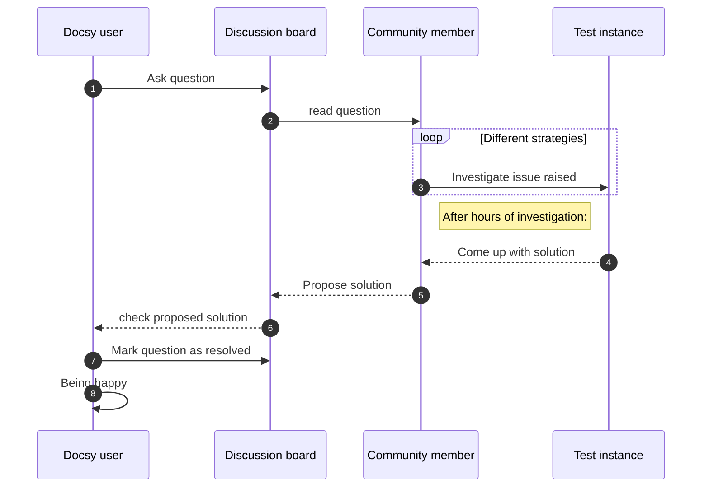

## Diagrams with Mermaid

[Mermaid](https://mermaid-js.github.io) is a Javascript library for rendering simple text definitions to useful diagrams in the browser.  It can generate a variety of different diagram types, including flowcharts, sequence diagrams, class diagrams, state diagrams, ER diagrams, user journey diagrams, Gantt charts and pie charts.

With Mermaid support enabled in Docsy, you can include the text definition of a Mermaid diagram inside a code block, and it will automatically be rendered by the browser as soon as the page loads.

The great advantage of this is anyone who can edit the page can now edit the diagram - no more hunting for the original tools and version to make a new edit.

For example, the following defines a sequence diagram:

````

````

which is automatically rendered to:


Support of Mermaid diagrams is automatically enabled as soon as you use a `mermaid` code block on your page.

By default, docsy pulls in the latest officially released version of Mermaid at build time. If that doesn't fit your needs, you can specify the wanted mermaid version inside your configuration file `hugo.toml`/`hugo.yaml`/`hugo.json`:




[params.mermaid]
version = "10.8.0"


params:
  mermaid:
    version: 10.8.0


{
  "params": {
    "mermaid": {
      "version": "10.8.0"
    }
  }
}



If needed, you can define custom settings for your diagrams, such as themes, padding in your `hugo.toml`/`hugo.yaml`/`hugo.json`.




[params.mermaid]
theme = "neutral"

[params.mermaid.flowchart]
diagramPadding = 6


params:
  mermaid:
    theme: neutral
    flowchart:
      diagramPadding: 6


{
  "params": {
    "mermaid": {
      "theme": "neutral",
      "flowchart": {
        "diagramPadding": 6
      }
    }
  }
}



See the [Mermaid documentation](https://mermaid-js.github.io/mermaid/#/Setup?id=mermaidapi-configuration-defaults) for a list of defaults that can be overridden.

Settings can also be overridden on a per-diagram basis by making use of a [frontmatter config](http://mermaid.js.org/config/theming.html#customizing-themes-with-themevariables) block at the start of the diagram definition.